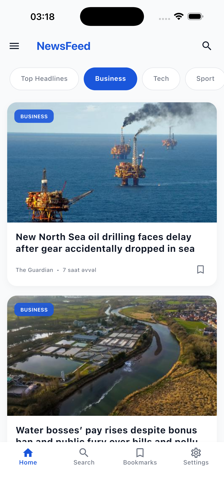
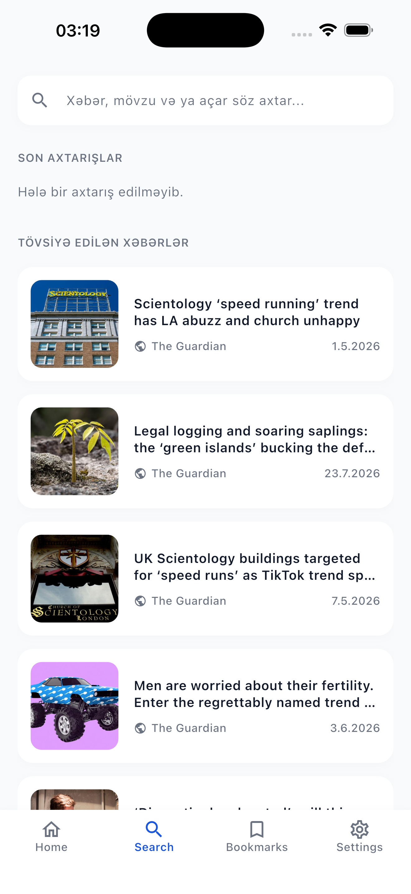
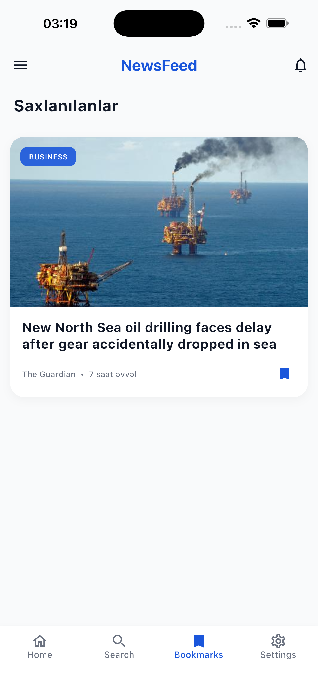
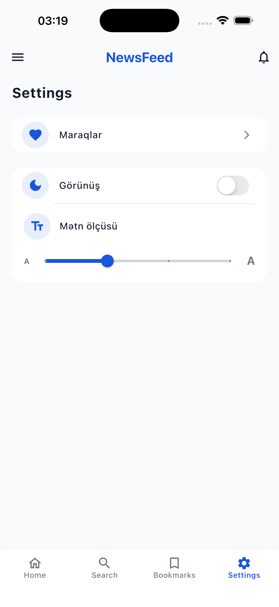
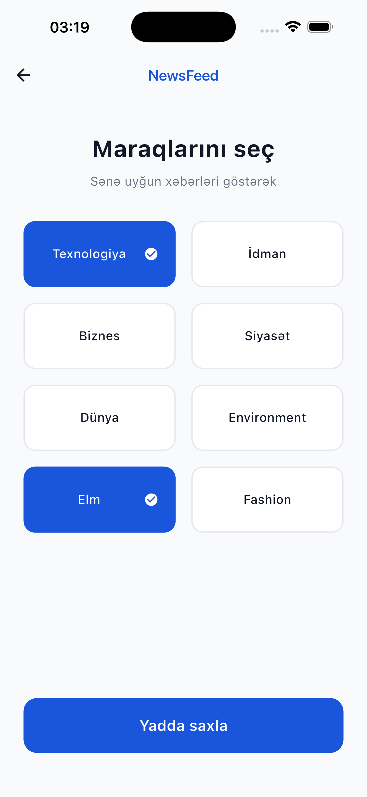
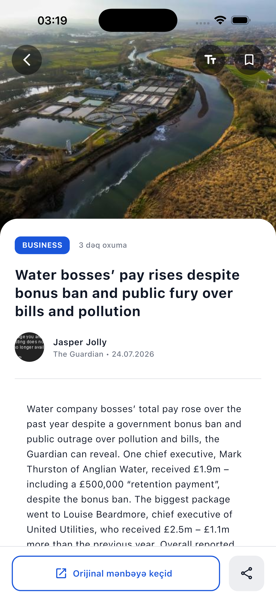

# NewsFeed 📰

Flutter ilə hazırlanmış, Clean Architecture prinsiplərinə əsaslanan xəbər oxuma tətbiqi. [The Guardian API](https://open-platform.theguardian.com/) üzərindən kateqoriyalara görə xəbərləri gətirir, axtarış, bookmark, oxunmuş məqalələr, dark/light tema və şrift ölçüsü tənzimləmələri kimi funksiyaları dəstəkləyir.

## ✨ Xüsusiyyətlər

- **Ana səhifə** — kateqoriyalara görə xəbər lenti, aşağı sürüşdükcə avtomatik yeni səhifə yüklənməsi (infinite scroll)
- **Axtarış** — açar sözlə xəbər axtarışı, son axtarışlar
- **Məqalə təfərrüatı** — WebView ilə orijinal mənbəyə keçid, şrift ölçüsünü tənzimləmə
- **Bookmarklar** — məqalələri saxlama və oflayn baxma
- **Oxunmuş məqalə izləmə** — hansı məqalələrin oxunduğunu yadda saxlayır
- **Onboarding** — istifadəçinin maraq dairəsinə uyğun kateqoriya seçimi
- **Tənzimləmələr** — dark/light tema, şrift ölçüsü slaydırı
- **Şəkil keşləməsi** — `cached_network_image` ilə optimallaşdırılmış şəkil yüklənməsi
- **Oflayn dəstək** — internet bağlantısı olmadıqda uyğun xəbərdarlıq

## 🏗️ Arxitektura

Layihə **Clean Architecture** prinsipi ilə qat-qat təşkil olunub:

```
lib/
├── app/                  # Tətbiqin kök widget-i
├── core/                 # Ümumi köməkçi qatlar
│   ├── constants/        # Rənglər, mətn stilləri, spacing, strings
│   ├── di/               # Dependency Injection (get_it)
│   ├── error/            # Failure / Exception sinifləri
│   ├── network/          # API constants, secure storage
│   ├── router/           # go_router konfiqurasiyası
│   ├── theme/            # Tema idarəetməsi
│   └── widgets/          # Bölünmüş ümumi widget-lər
└── features/             # Hər feature öz qatları ilə
    ├── home/
    ├── search/
    ├── article_detail/
    ├── bookmarks/
    ├── settings/
    ├── onboarding/
    ├── webview/
    └── news/             # Domain + Data qatları (repository, usecase, model, entity)
        ├── data/
        └── domain/
```

Hər feature `presentation` (UI + Cubit), `domain` (entities, usecases, repository interface) və `data` (models, datasources, repository impl) qatlarına bölünür.

## 🛠️ İstifadə olunan texnologiyalar

| Kateqoriya            | Paket                                            |
|------------------------|--------------------------------------------------|
| State management       | `flutter_bloc` (Cubit)                            |
| Dependency Injection    | `get_it`                                          |
| Network                | `dio`                                             |
| Routing                | `go_router`                                       |
| Local storage          | `get_storage`, `flutter_secure_storage`           |
| Şəkil keşləməsi        | `cached_network_image`                            |
| Responsive UI          | `flutter_screenutil`                              |
| Funksional error handling | `dartz` (Either/Failure)                       |
| Connectivity           | `connectivity_plus`                               |

## 🚀 Başlamaq

### Tələblər

- Flutter SDK (stabil kanal)
- Dart SDK
- The Guardian API açarı — [buradan](https://open-platform.theguardian.com/access/) pulsuz əldə edə bilərsiniz

### Quraşdırma

```bash
git clone <repo-url>
cd news_feed
flutter pub get
```

### API açarını təyin et

`lib/core/network/api_constants.dart` faylında öz API açarınızı yazın:

```dart
class ApiConstants {
  static const String baseUrl = 'https://content.guardianapis.com';
  static const String apiKey = 'YOUR_API_KEY_HERE';
  static const int pageSize = 20;
}
```

### İşə salmaq

```bash
flutter run
```

## 📄 API

Tətbiq [The Guardian Content API](https://open-platform.theguardian.com/documentation/)-dan istifadə edir:

- `GET /search` — kateqoriyaya görə xəbərləri gətirmək (`section` parametri ilə)
- `GET /search?q=` — açar sözlə axtarış
- Səhifələmə `page` və `page-size` parametrləri ilə idarə olunur

## 📱 Ekranlar

- Onboarding → maraq dairəsi seçimi
- Ana səhifə → kateqoriya tabları + xəbər lenti (infinite scroll)
- Axtarış → axtarış inputu + nəticələr / son axtarışlar
- Məqalə təfərrüatı → tam məzmun + WebView keçidi
- Bookmarklar → saxlanılan məqalələr
- Tənzimləmələr → tema və şrift tənzimləmələri

## 📸 Ekran görüntüləri

<table>
<tr>
<td align="center"><b>Onboarding</b><br/></td>
<td align="center"><b>Ana səhifə</b><br/></td>
<td align="center"><b>Axtarış</b><br/></td>
</tr>
<tr>
<td align="center"><b>Bookmarklar</b><br/></td>
<td align="center"><b>Tənzimləmələr</b><br/></td>
<td align="center"><b>Maraqları redaktə et</b><br/></td>
</tr>
<tr>
<td align="center"><b>Məqalə təfərrüatı</b><br/></td>
<td></td>
<td></td>
</tr>
</table>

## 📝 Lisenziya

Bu layihə təhsil/nümayiş məqsədləri üçün hazırlanmışdır.